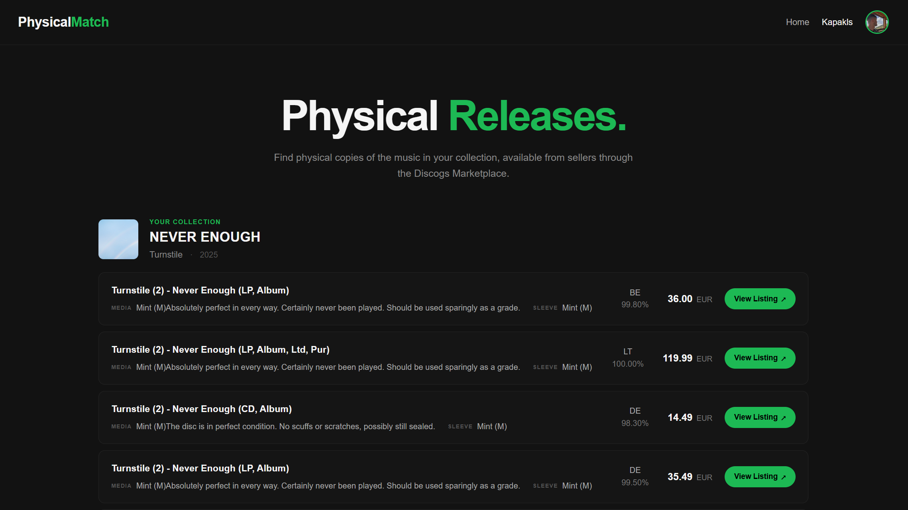

# PhysicalMatch

PhysicalMatch is a full-stack application for discovering physical music releases corresponding to a user's Spotify library through the Discogs Marketplace.

The application combines a Django web application with a dedicated FastAPI service for Marketplace search and listing matching. Spotify provides the user's music library, while the Marketplace service handles Discogs integration, listing extraction, normalization, and similarity-based matching.

## Screenshots

### Music Library



## Architecture

PhysicalMatch is composed of two independently structured applications:

```text
PhysicalMatch
│
├── Django Application
│   ├── Authentication
│   ├── Spotify Integration
│   ├── Library Management
│   ├── PostgreSQL Persistence
│   └── Web Interface
│
└── FastAPI Marketplace Service
    ├── API Routes
    ├── Marketplace Service
    ├── Discogs Client
    ├── Discogs Parser
    └── Pydantic Schemas
```

The Django application owns the user-facing application and persistent domain data. Marketplace-specific functionality is isolated behind a FastAPI service, separating external data acquisition and matching logic from the primary web application.

The FastAPI service follows a layered approach:

```text
Request
   │
   ▼
Route
   │
   ▼
MarketplaceService
   │
   ├── DiscogsClient
   │       │
   │       ▼
   │   Discogs Marketplace
   │
   └── DiscogsParser
           │
           ▼
     Structured Listings
```

This keeps HTTP communication, parsing, business logic, and API schemas independently testable and replaceable.

## Core Functionality

PhysicalMatch currently provides:

* Spotify OAuth authentication and library retrieval.
* Persistent storage of Spotify album metadata.
* Discogs Marketplace search and listing extraction.
* Similarity-based matching between albums and Marketplace listings.
* Structured Marketplace responses through a REST API.
* Listing metadata including price, currency, conditions, seller information, and similarity score.
* PostgreSQL-backed application persistence.

## Technology Stack

### Application

* Python
* Django
* FastAPI
* Pydantic
* PostgreSQL

### Integrations

* Spotify Web API
* Discogs Marketplace

### Frontend

* HTML
* CSS
* JavaScript

### Supporting Libraries

* Requests
* Cloudscraper
* BeautifulSoup4
* pycountry
* Uvicorn

## Marketplace Matching

Marketplace matching is handled independently from the Django application by the FastAPI service.

For each requested album, the service:

1. Queries the Discogs Marketplace using the supplied artist and album.
2. Parses the returned Marketplace data into structured listing objects.
3. Normalizes the album and listing titles into comparable word sets.
4. Calculates Jaccard similarity between the album title and each listing title.
5. Filters listings against the configured similarity threshold.
6. Returns the matching listings as a validated `MarketplaceMatchResponse`.

The similarity calculation is based on the intersection and union of the token sets:

```text
similarity = |album_words ∩ listing_words|
             ───────────────────────────────
             |album_words ∪ listing_words|
```

The threshold is configurable per request, allowing consumers of the API to control the strictness of matching.

## API

The Marketplace functionality is exposed through FastAPI.

A request consists of the artist, album, and an optional similarity threshold.

```text
GET /marketplace/...
```

The service returns a structured response containing the requested album, applied threshold, number of matches, and Marketplace listing metadata.

Example:

```json
{
    "album": "NEVER ENOUGH",
    "threshold": 0.1,
    "total": 1,
    "listings": [
        {
            "title": "Turnstile (2) - Never Enough (LP, Album)",
            "price": "37.99",
            "currency": "EUR",
            "listing_id": "4289311446",
            "listing_url": "https://www.discogs.com/sell/item/4289311446",
            "seller_country": "DE",
            "media_condition": "Mint (M)Absolutely perfect in every way. Certainly never been played. Should be used sparingly as a grade.",
            "sleeve_condition": "Mint (M)",
            "seller_rating": "100.0",
            "similarity": 0.3333333333333333
        }
    ]
}
```

FastAPI provides interactive API documentation through Swagger UI and ReDoc.

## Data Persistence

PostgreSQL is used as the application's primary relational database.

The Django application persists Spotify album metadata and Marketplace information using relational models. Albums and Marketplace listings are associated so that discovered physical releases can be linked to their corresponding library entries.

The current data model includes entities for:

* Users
* Albums
* Discogs Marketplace Listings

## Spotify Integration

Spotify is used as the source of the user's music library.

```text
User
 │
 ▼
Spotify OAuth
 │
 ▼
Spotify Web API
 │
 ▼
Album Metadata
 │
 ▼
PostgreSQL
 │
 ▼
Marketplace Matching
```

Spotify-specific integration is kept within the Django application, while Marketplace functionality is delegated to the FastAPI service.

## Running Locally

Create a virtual environment:

```bash
python -m venv .venv
```

Activate it on Windows:

```powershell
.\.venv\Scripts\Activate.ps1
```

Install dependencies:

```powershell
python -m pip install -r requirements.txt
```

Configure the required application and Spotify credentials.

Start the FastAPI Marketplace service:

```powershell
python -m uvicorn main:app --reload
```

The API will be available at:

```text
http://127.0.0.1:8000
```

Interactive API documentation:

```text
http://127.0.0.1:8000/docs
```

Start the Django application separately:

```powershell
python manage.py runserver
```

## Disclaimer

PhysicalMatch interacts with third-party services, including Spotify and Discogs, and uses web scraping for Marketplace data acquisition.

Users are responsible for complying with the applicable terms of service, API policies, and usage restrictions of these services.

For Discogs, refer to the [Discogs Terms of Service](https://support.discogs.com/hc/en-us/articles/360009334333-Terms-of-Service).

## License

This project is provided for personal and educational development purposes.

## AI Disclaimer

No AI-generated code was used in the backend implementation of PhysicalMatch. The backend architecture, business logic, API implementation, integrations, and data models were designed and implemented manually.

AI tools were used only as an assistance tool during the development of the user interface.